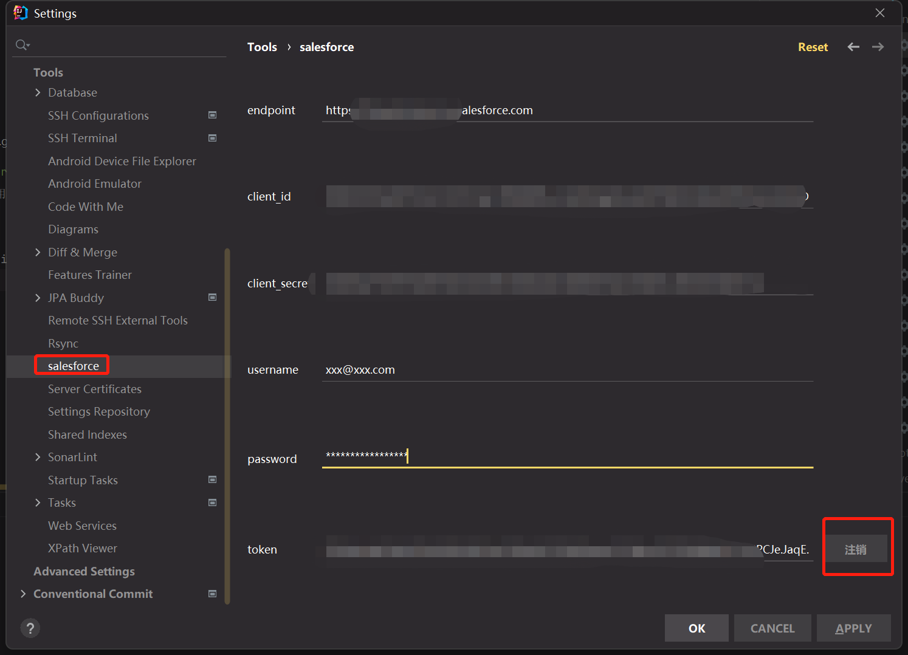
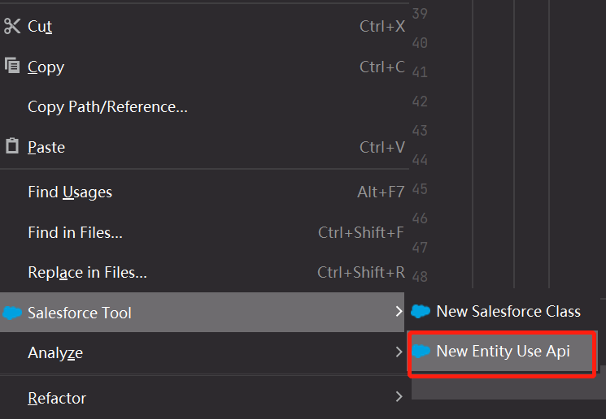
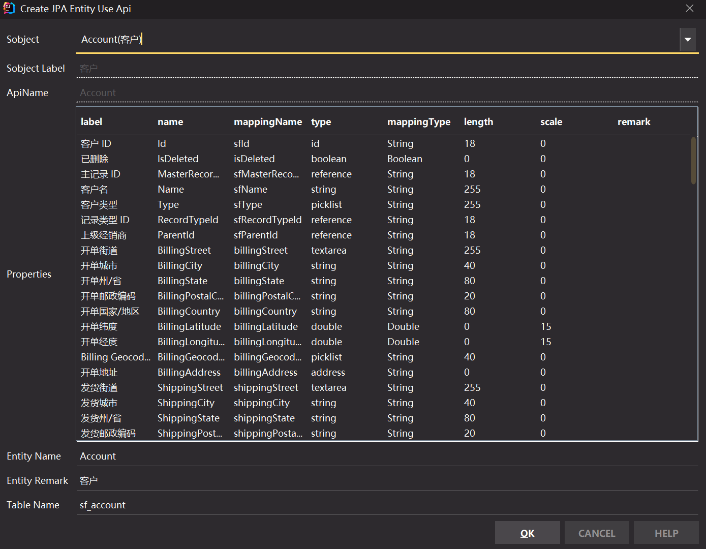
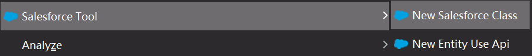
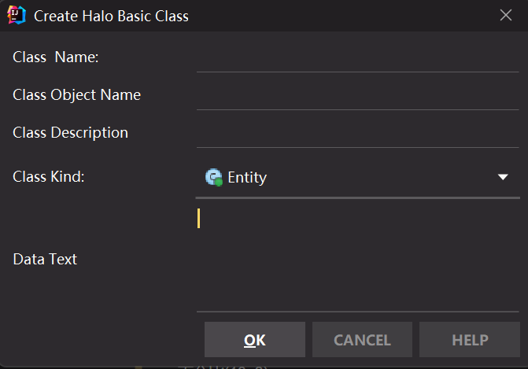
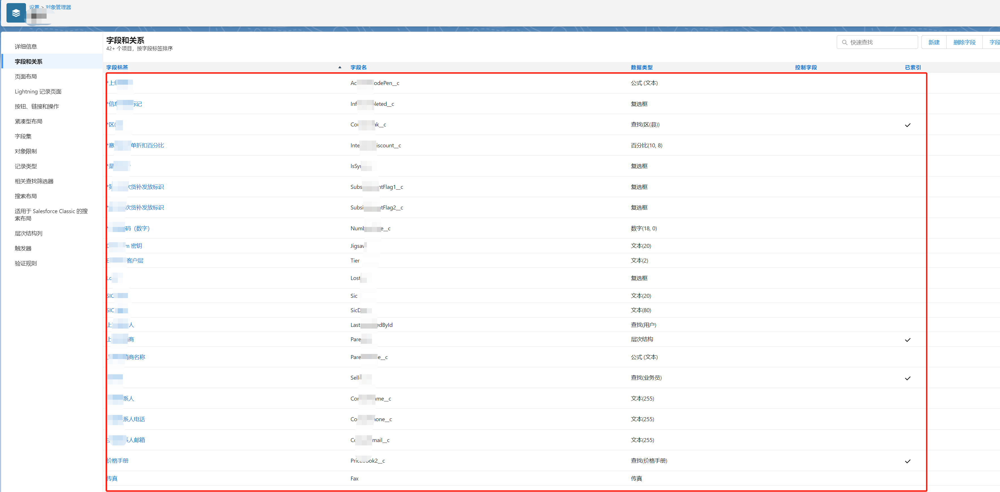

# salesforce-jpa-idea-plugin
插件主要作用是通过salesforce rest api 或 salesforce对象管理器中的属性描述文本自动生成jpa entity class等

# 一、使用说明：
  
## 1.salesforce setting(Optional)

*如果需要使用 New Entity Use Api 则该项必填！！！！！*

  

## 2.New Entity Use Api(Optional)

###·在需要生成class的package上使用右键菜单  

  
###·填写生成参数  
*（注1：Properties是可以选择的，必须选择需要生成的属性，ctrl+a全选）*  
*（注2：Properties中的单元格可以进行修改）*  


## 3.New Entity Use Api(Optional)

### ·在需要生成class的package上使用右键菜单    
  


  
### ·从salesforce对象管理器复制文本 **贴入Data Text**


  
### 格式如下：  

*上xx码 &emsp;  AccouxxodePen__c	&emsp;  公式 (文本)  
*信xx整标记 &emsp;  Infxxompleted__c	&emsp;  复选框  
*xxxx)  &emsp; Countxxak__c	&emsp;  查找(区(县))  
*意向xx折扣百分比  &emsp;  Intentxxcount__c	&emsp;  百分比(10, 8)  

# 二、结果展示：
```kotlin
@Schema(description = "AI 应用程序")
@SalesforceEntity("AIApplication")
@Entity
@Table(name = "sf_a_i_application")
class AIApplication : NormalSalesForceEntity() {

    @Schema(description = "AI 应用程序 ID")
    @SalesforceProperty("Id")
    @Column(length = 18, scale = 0 )
    var sfId: String? = null

    @Schema(description = "已删除")
    @SalesforceProperty("IsDeleted")
    var isDeleted: Boolean? = null

    @Schema(description = "名称")
    @SalesforceProperty("DeveloperName")
    @Column(length = 80, scale = 0 )
    var developerName: String? = null

    @Schema(description = "主语言")
    @SalesforceProperty("Language")
    @Column(length = 40, scale = 0 )
    var language: String? = null

    @Schema(description = "标签")
    @SalesforceProperty("MasterLabel")
    @Column(length = 80, scale = 0 )
    var masterLabel: String? = null

    @Schema(description = "命名空间前缀")
    @SalesforceProperty("NamespacePrefix")
    @Column(length = 15, scale = 0 )
    var namespacePrefix: String? = null

    @Schema(description = "创建日期")
    @SalesforceProperty("CreatedDate")
    var createdDate: Date? = null

    @Schema(description = "创建人 ID")
    @SalesforceProperty("CreatedById")
    @Column(length = 18, scale = 0 )
    var sfCreatedById: String? = null

    @Schema(description = "上次修改日期")
    @SalesforceProperty("LastModifiedDate")
    var lastModifiedDate: Date? = null

    @Schema(description = "上次修改人 ID")
    @SalesforceProperty("LastModifiedById")
    @Column(length = 18, scale = 0 )
    var sfLastModifiedById: String? = null

    @Schema(description = "系统修改时间戳")
    @SalesforceProperty("SystemModstamp")
    var systemModstamp: Date? = null

    @Schema(description = "状态")
    @SalesforceProperty("Status")
    @Column(length = 255, scale = 0 )
    var status: String? = null

    @Schema(description = "应用程序类型")
    @SalesforceProperty("Type")
    @Column(length = 255, scale = 0 )
    var sfType: String? = null

    companion object {
        const val SOQL = "SELECT Id,IsDeleted,DeveloperName,Language,MasterLabel,NamespacePrefix,CreatedDate,CreatedById,LastModifiedDate,LastModifiedById,SystemModstamp,Status,Type FROM AIApplication"
    }

}
```
